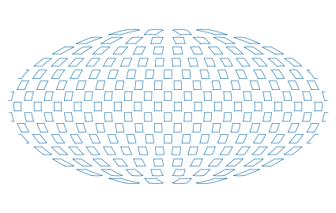
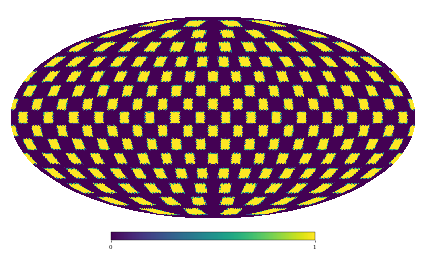

minimask
=======================

Light-weight routines for processing sky survey masks

Philosophy 
---------- 

A survey coverage mask is made up of a large number of tiles forming a mosaic
on the sky.  Each tile can be represented as a group of convex spherical
polygons.  We will optimize for the case when the polygons are small, less
than 1 degree, and the mosaic covers a large fraction of the sky. So we can
reference the polygons efficiently by a center point and sort them with
spatial indices.

The main operations to be carried out are:

* query polygons that contain a given point
* draw random samples of points from the area covered

Quick start
-----------

Load a mask polygon file and generate uniform random samples:

>>> M = minimask.Mask("survey.txt.gz")
>>> ra, dec = M.sample(n=10000)         # generate 10,000 points
>>> ra, dec = M.sample(density=10)      # ...or with number density 10 / square degree

Check if points are inside a polygon:

>>> inside = M.contains(ra, dec)
>>> print inside
[ True  True  True ...,  True  True  True]

Query weights:

>>> w = M.get_combined_weight(ra, dec, operation='sum')

Make plots:

>>> healpy.mollview()
>>> for x,y in M.render():
>>>    healpy.projplot(x, y, lonlat=True)
>>> pylab.show()

Pixelize with healpix:

>>> map = M.pixelize(nside=64)
>>> healpy.mollview(map)

Dependencies
------------
* `python 2.7 <https://python.org>`_
* `numpy <https://numpy.org>`_
* `scipy <https://scipy.org>`_ 
* `scikit-learn <https://scikit-learn.org>`_
* `healpy <https://github.com/healpy/healpy>`_

Contributors
------------
Ben Granett, Dida Markovic
